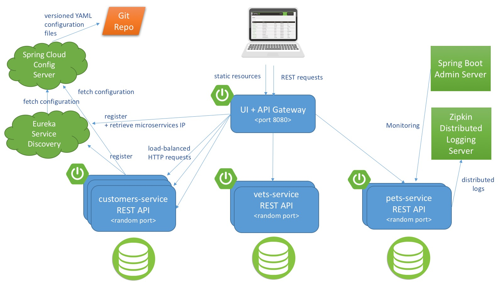
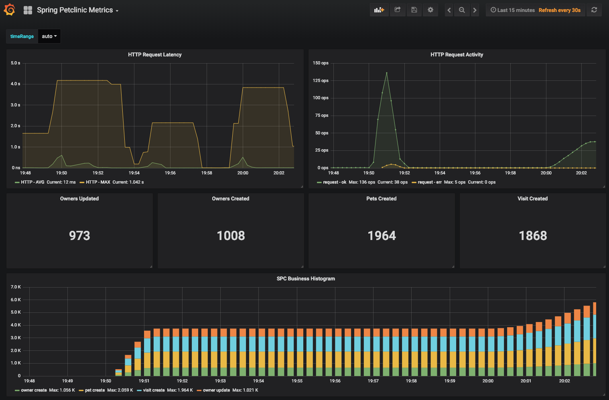

# Spring PetClinic 

[](https://travis-ci.org/spring-petclinic/spring-petclinic-microservices/) [](https://opensource.org/licenses/Apache-2.0)

Distributed version of the Sample Application built with Spring Cloud. Instrumented with the Splunk distribution of the OpenTelemetry Java Instrumentation and accompanied by OpenTelemetry Collector.


This microservices branch was initially derived from [AngularJS version](https://github.com/spring-petclinic/spring-petclinic-angular1) to demonstrate how to split sample Spring application into [microservices](http://www.martinfowler.com/articles/microservices.html).
To achieve that goal we use Spring Cloud Gateway, Spring Cloud Circuit Breaker, Spring Cloud Config, Spring Cloud Sleuth, Resilience4j, Micrometer 
and the Eureka Service Discovery from the [Spring Cloud Netflix](https://github.com/spring-cloud/spring-cloud-netflix) technology stack.

## Starting the application with instrumentation

In order to start the application as configured for Splunk OpenTelemetry distribution, simply run `start.sh`. The script will:
- download the agent
- build Docker images
- run all microservices using Docker compose

If everything goes well, you can access the following services at given location:
* Discovery Server - http://localhost:8761
* Config Server - http://localhost:8888
* AngularJS frontend (API Gateway) - http://localhost:8080
* Customers, Vets and Visits Services - random port, check Eureka Dashboard 
* Otel Collector - http://localhost:55680
* Tracing Server (Zipkin) - http://localhost:9411/zipkin/ (we use [openzipkin](https://github.com/openzipkin/zipkin/tree/master/zipkin-server))
* Admin Server (Spring Boot Admin) - http://localhost:9090
* Grafana Dashboards - http://localhost:3000
* Prometheus - http://localhost:9091

## Downloading OpenTelemetry Java Agent

Download the [latest release](https://github.com/signalfx/splunk-otel-java/releases/latest/download/splunk-otel-javaagent-all.jar)
   of the Splunk Distribution of OpenTelemetry Java Instrumentation. For example use: 
   ```bash
   $ # download the newest version of the agent
   $ sudo curl -vsSL -o /opt/splunk-otel-javaagent-all.jar 'https://github.com/signalfx/splunk-otel-java/releases/latest/download/splunk-otel-javaagent-all.jar'
   ```

## Starting services locally with docker-compose
In order to start entire infrastructure using Docker, you have to build images by executing `./mvnw clean install -P buildDocker` 
from a project root. Once images are ready, you can start them with a single command
`docker-compose up`. Containers startup order is coordinated with [`dockerize` script](https://github.com/jwilder/dockerize). 
After starting services it takes a while for API Gateway to be in sync with service registry,
so don't be scared of initial Spring Cloud Gateway timeouts. You can track services availability using Eureka dashboard
available by default at http://localhost:8761.

The `master` branch uses an  Alpine linux  with JRE 8 as Docker base. You will find a Java 11 version in the `release/java11` branch.

*NOTE: Under MacOSX or Windows, make sure that the Docker VM has enough memory to run the microservices. The default settings
are usually not enough and make the `docker-compose up` painfully slow.*

## Understanding the Spring Petclinic application

[See the presentation of the Spring Petclinic Framework version](http://fr.slideshare.net/AntoineRey/spring-framework-petclinic-sample-application)

[A blog bost introducing the Spring Petclinic Microsevices](http://javaetmoi.com/2018/10/architecture-microservices-avec-spring-cloud/) (french language)

You can then access petclinic here: http://localhost:8080/


**Architecture diagram of the Spring Petclinic Microservices**




## In case you find a bug/suggested improvement for Spring Petclinic Microservices

Our issue tracker is available here: https://github.com/spring-petclinic/spring-petclinic-microservices/issues

## Database configuration

In its default configuration, Petclinic uses an in-memory database (HSQLDB) which gets populated at startup with data.

## Custom metrics monitoring

Grafana and Prometheus are included in the `docker-compose.yml` configuration, and the public facing applications
have been instrumented with [MicroMeter](https://micrometer.io) to collect JVM and custom business metrics.

A JMeter load testing script is available to stress the application and generate metrics: [petclinic_test_plan.jmx](spring-petclinic-api-gateway/src/test/jmeter/petclinic_test_plan.jmx)



### Using Prometheus

* Prometheus can be accessed from your local machine at http://localhost:9091

### Using Grafana with Prometheus

* An anonymous access and a Prometheus datasource are setup.
* A `Spring Petclinic Metrics` Dashboard is available at the URL http://localhost:3000/d/69JXeR0iw/spring-petclinic-metrics.
You will find the JSON configuration file here: [docker/grafana/dashboards/grafana-petclinic-dashboard.json]().
* You may create your own dashboard or import the [Micrometer/SpringBoot dashboard](https://grafana.com/dashboards/4701) via the Import Dashboard menu item.
The id for this dashboard is `4701`.

### Custom metrics
Spring Boot registers a lot number of core metrics: JVM, CPU, Tomcat, Logback... 
The Spring Boot auto-configuration enables the instrumentation of requests handled by Spring MVC.
All those three REST controllers `OwnerResource`, `PetResource` and `VisitResource` have been instrumented by the `@Timed` Micrometer annotation at class level.

* `customers-service` application has the following custom metrics enabled:
  * @Timed: `petclinic.owner`
  * @Timed: `petclinic.pet`
* `visits-service` application has the following custom metrics enabled:
  * @Timed: `petclinic.visit`

## Looking for something in particular?

| Spring Cloud components         | Resources  |
|---------------------------------|------------|
| Configuration server            | [Config server properties](spring-petclinic-config-server/src/main/resources/application.yml) and [Configuration repository] |
| Service Discovery               | [Eureka server](spring-petclinic-discovery-server) and [Service discovery client](spring-petclinic-vets-service/src/main/java/org/springframework/samples/petclinic/vets/VetsServiceApplication.java) |
| API Gateway                     | [Spring Cloud Gateway starter](spring-petclinic-api-gateway/pom.xml) and [Routing configuration](/spring-petclinic-api-gateway/src/main/resources/application.yml) |
| Docker Compose                  | [Spring Boot with Docker guide](https://spring.io/guides/gs/spring-boot-docker/) and [docker-compose file](docker-compose.yml) |
| Circuit Breaker                 | [Resilience4j fallback method](spring-petclinic-api-gateway/src/main/java/org/springframework/samples/petclinic/api/boundary/web/ApiGatewayController.java)  |
| Grafana / Prometheus Monitoring | [Micrometer implementation](https://micrometer.io/), [Spring Boot Actuator Production Ready Metrics] |

 Front-end module  | Files |
|-------------------|-------|
| Node and NPM      | [The frontend-maven-plugin plugin downloads/installs Node and NPM locally then runs Bower and Gulp](spring-petclinic-ui/pom.xml)  |
| Bower             | [JavaScript libraries are defined by the manifest file bower.json](spring-petclinic-ui/bower.json)  |
| Gulp              | [Tasks automated by Gulp: minify CSS and JS, generate CSS from LESS, copy other static resources](spring-petclinic-ui/gulpfile.js)  |
| Angular JS        | [app.js, controllers and templates](spring-petclinic-ui/src/scripts/)  |


## Interesting Spring Petclinic forks

The Spring Petclinic master branch in the main [spring-projects](https://github.com/spring-projects/spring-petclinic)
GitHub org is the "canonical" implementation, currently based on Spring Boot and Thymeleaf.

This [spring-petclinic-microservices](https://github.com/spring-petclinic/spring-petclinic-microservices/) project is one of the [several forks](https://spring-petclinic.github.io/docs/forks.html) 
hosted in a special GitHub org: [spring-petclinic](https://github.com/spring-petclinic).
If you have a special interest in a different technology stack
that could be used to implement the Pet Clinic then please join the community there.


# Contributing

The [issue tracker](https://github.com/spring-petclinic/spring-petclinic-microservices/issues) is the preferred channel for bug reports, features requests and submitting pull requests.

For pull requests, editor preferences are available in the [editor config](.editorconfig) for easy use in common text editors. Read more and download plugins at <http://editorconfig.org>.


[Configuration repository]: https://github.com/spring-petclinic/spring-petclinic-microservices-config
[Spring Boot Actuator Production Ready Metrics]: https://docs.spring.io/spring-boot/docs/current/reference/html/production-ready-metrics.html
