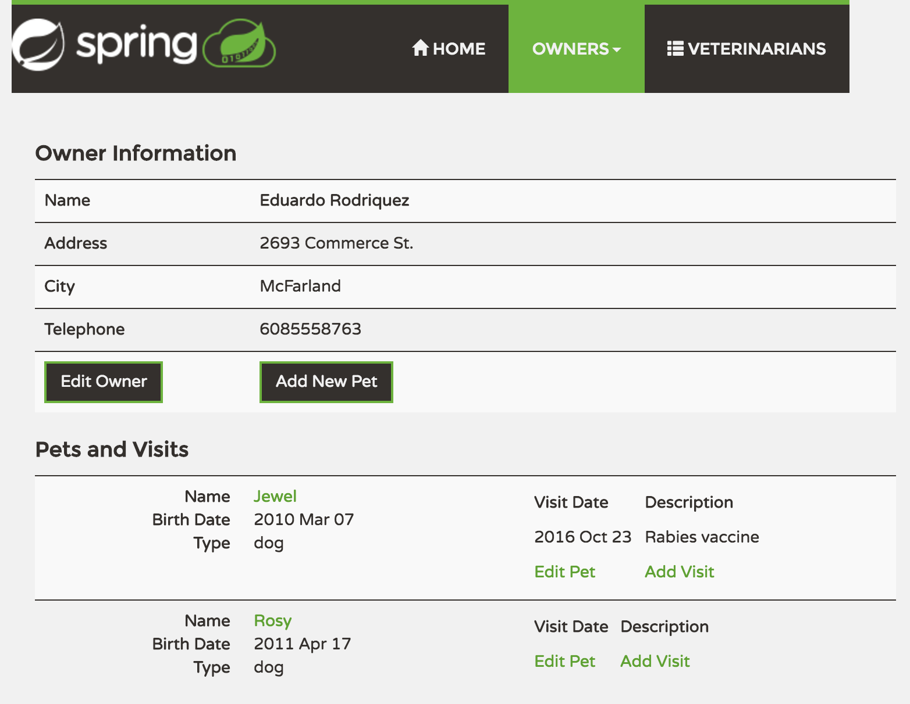
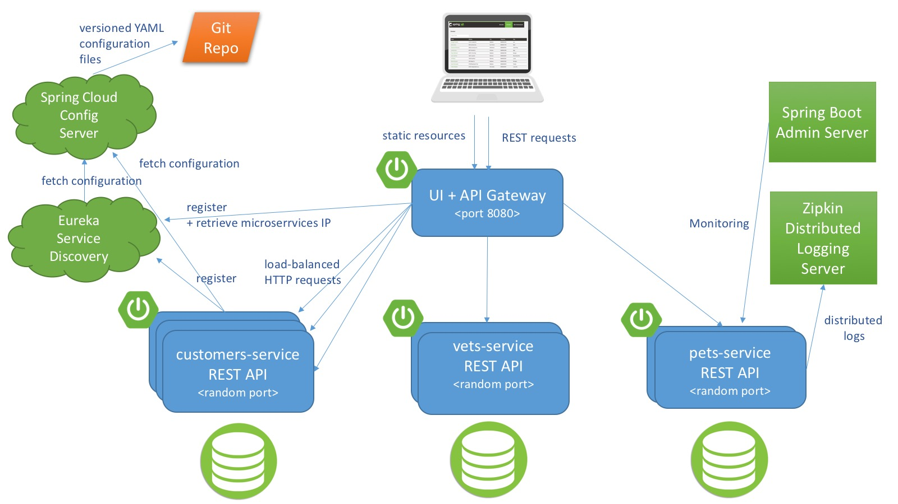
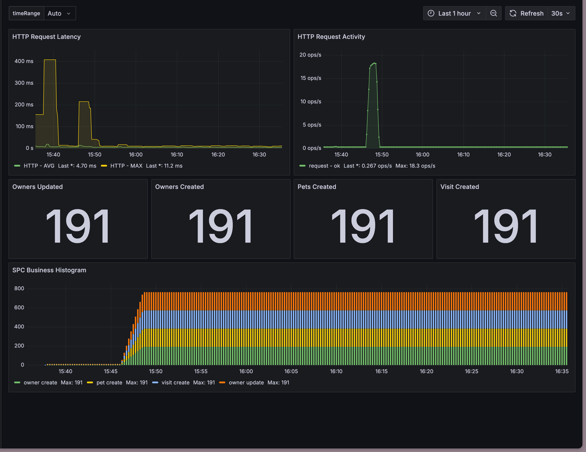

# Distributed version of the Spring PetClinic Sample Application built with Spring Cloud and Spring AI

[](https://github.com/spring-petclinic/spring-petclinic-microservices/actions/workflows/maven-build.yml)
[](https://opensource.org/licenses/Apache-2.0)

This microservices branch was initially derived from [AngularJS version](https://github.com/spring-petclinic/spring-petclinic-angular1) to demonstrate how to split sample Spring application into [microservices](http://www.martinfowler.com/articles/microservices.html).
To achieve that goal, we use Spring Cloud Gateway, Spring Cloud Circuit Breaker, Micrometer Tracing, Resilience4j and Open Telemetry.

This fork is adapted for Kubernetes: the platform provides service discovery and configuration,
so the Config Server, the Eureka Discovery Server and Spring Boot Admin have been removed.
Services find each other through Kubernetes Service DNS names and read their configuration
from a mounted ConfigMap. See [Kubernetes-native discovery and configuration](#kubernetes-native-discovery-and-configuration).

[](https://codespaces.new/spring-petclinic/spring-petclinic-microservices)

[](https://app.codeanywhere.com/#https://github.com/spring-petclinic/spring-petclinic-microservices)

## Kubernetes-native discovery and configuration

The applications are ordinary Spring Boot services. Everything that used to be provided by
Spring Cloud infrastructure is now provided by the platform.

**Discovery.** There is no registry and no client-side load balancer. Services address each other
by Kubernetes Service DNS name, and the Service load-balances across the ready pods behind it:

```yaml
spring.cloud.gateway.server.webflux.routes:
  - id: customers-service
    uri: http://customers-service:8081
    predicates: [ Path=/api/customer/** ]
    filters: [ StripPrefix=2 ]
```

The gateway's `WebClient.Builder` bean is a plain one - no `@LoadBalanced` - and the same holds for
`genai-service`, which previously resolved `customers-service` through a `DiscoveryClient`.
The addresses live under `petclinic.<service>.url` so they can be overridden per environment.

**Configuration.** There is no Config Server and no `spring.config.import`. Each service ships
sensible defaults in its own `src/main/resources/application.yml` and reads environment-specific
overrides from two mounted directories, declared once in [docker/Dockerfile](docker/Dockerfile):

```
SPRING_CONFIG_ADDITIONAL_LOCATION=optional:file:/config/common/,optional:file:/config/app/
```

| Location | Content | docker-compose | Kubernetes |
|---|---|---|---|
| `classpath:application.yml` | app defaults, shipped in the jar | - | - |
| `/config/common/` | settings shared by all services | bind mount of `config/common` | ConfigMap `petclinic-common` |
| `/config/app/` | per-service settings | bind mount of `config/<service>` | ConfigMap `<service>-config` |

Later locations win, so `/config/app/` overrides `/config/common/`, which overrides the jar.
Both locations are `optional:`, so an image still starts with nothing mounted.

**Secrets** stay out of the ConfigMaps. `genai-service` receives `OPENAI_API_KEY` as an environment
variable - from `.env` under compose, from a Secret in the cluster (see
[k8s/02-secrets.yaml](k8s/02-secrets.yaml), which points at External Secrets or Vault for real use).

**Resilience4j is untouched.** It is plain library code, not Spring Cloud infrastructure, so the
circuit breakers and the gateway fallback work exactly as before.

Manifests live in [k8s/](k8s/); see [k8s/README.md](k8s/README.md).

## Starting services locally without Docker

Every microservice is a Spring Boot application and can be started locally using IDE or `../mvnw spring-boot:run` command.
There is no supporting service to start first and no startup order to respect: each application boots on its own,
and the API Gateway simply returns its circuit-breaker fallback until the service it needs is up.
Startup of Tracing server, Grafana and Prometheus is optional.
If everything goes well, you can access the following services at given location:
* AngularJS frontend (API Gateway) - http://localhost:8080
* Customers Service - http://localhost:8081
* Visits Service - http://localhost:8082
* Vets Service - http://localhost:8083
* GenAI Service - http://localhost:8084
* Tracing Server (Zipkin) - http://localhost:9411/zipkin/ (we use [openzipkin](https://github.com/openzipkin/zipkin/tree/main/zipkin-server))
* Grafana Dashboards - http://localhost:3030
* Prometheus - http://localhost:9091

Started this way each application uses only the defaults baked into its own `application.yml`, which already
point at `localhost`-free container names. To run the jars on the host with everything on localhost, use
`./scripts/run_all.sh`, which layers `config/local/` on top.

## Starting services locally with docker-compose
In order to start entire infrastructure using Docker, you have to build images by executing
``bash
./mvnw clean install -P buildDocker
``
This requires `Docker` or `Docker desktop` to be installed and running.

Alternatively you can also build all the images on `Podman`, which requires Podman or Podman Desktop to be installed and running.
```bash
./mvnw clean install -PbuildDocker -Dcontainer.executable=podman
```
By default, the Docker OCI image is build for an `linux/amd64` platform.
For other architectures, you could change it by using the `-Dcontainer.platform` maven command line argument.
For instance, if you target container images for an Apple M2, you could use the command line with the `linux/arm64` architecture:
```bash
./mvnw clean install -P buildDocker -Dcontainer.platform="linux/arm64"
```

Once images are ready, you can start them with a single command
`docker compose up` or `podman-compose up`. 

There is no `depends_on` ordering: as in Kubernetes, every container starts at once and the API Gateway
tolerates a downstream service that is not ready yet. Each container declares a
[healthcheck](https://github.com/compose-spec/compose-spec/blob/main/spec.md#healthcheck) against
`/actuator/health/readiness`, the same endpoint the Kubernetes readinessProbe uses, so
`docker compose ps` shows when the stack is fully up.

The `main` branch uses an Eclipse Temurin with Java 17 as Docker base image.

*NOTE: Under MacOSX or Windows, make sure that the Docker VM has enough memory to run the microservices. The default settings
are usually not enough and make the `docker-compose up` painfully slow.*


## Starting services locally with docker-compose and Java
If you experience issues with running the system via docker-compose you can try running the `./scripts/run_all.sh` script that will start the infrastructure 
services via `docker compose` and all the Java based applications via standard `nohup java -jar ...` command.
The logs will be available under `${ROOT}/target/nameoftheapp.log`.

By default the applications are started without the `chaos-monkey` profile. Pass the optional `--chaos-monkey` flag to enable it and interact with Spring Boot Chaos Monkey:
```bash
./scripts/run_all.sh --chaos-monkey
```
You can check out the [README](scripts/chaos/README.md) for more information about how to use the `./scripts/chaos/call_chaos.sh` helper script to enable assaults.

Use `./scripts/stop_all.sh` to stop all the Java applications and the docker-compose infrastructure containers started by `run_all.sh`.

## Understanding the Spring Petclinic application

[See the presentation of the Spring Petclinic Framework version](http://fr.slideshare.net/AntoineRey/spring-framework-petclinic-sample-application)

[A blog post introducing the Spring Petclinic Microsevices](http://javaetmoi.com/2018/10/architecture-microservices-avec-spring-cloud/) (french language)

You can then access petclinic here: http://localhost:8080/

## Microservices Overview

This project consists of several microservices:
- **Customers Service**: Manages customer data.
- **Vets Service**: Handles information about veterinarians.
- **Visits Service**: Manages pet visit records.
- **GenAI Service**: Provides a chatbot interface to the application.
- **API Gateway**: Routes client requests to the appropriate services.

Configuration and service discovery are provided by the platform rather than by dedicated services.

Each service has its own specific role and communicates via REST APIs.





**Architecture diagram of the Spring Petclinic Microservices**



## Integrating the Spring AI Chatbot

Spring Petclinic integrates a Chatbot that allows you to interact with the application in a natural language. Here are some examples of what you could ask:

1. Please list the owners that come to the clinic.
2. Are there any vets that specialize in surgery?
3. Is there an owner named Betty?
4. Which owners have dogs?
5. Add a dog for Betty. Its name is Moopsie.
6. Create a new owner.


This `spring-petclinic-genai-service` microservice currently supports **OpenAI** (default) or **Azure's OpenAI** as the LLM provider.
In order to start the microservice, perform the following steps:

1. Decide which provider you want to use. By default, the `spring-ai-starter-model-openai` dependency is enabled. 
   You can change it to `spring-ai-starter-model-azure-openai`in the `pom.xml`.
2. Create an OpenAI API key or an Azure OpenAI resource in your Azure Portal.
   Refer to the [OpenAI's quickstart](https://platform.openai.com/docs/quickstart) or [Azure's documentation](https://learn.microsoft.com/en-us/azure/ai-services/openai/) for further information on how to obtain these.
   You only need to populate the provider you're using - either openai, or azure-openai.
   If you don't have your own OpenAI API key, don't worry!
   You can temporarily use the `demo` key, which OpenAI provides free of charge for demonstration purposes.
   This `demo` key has a quota, is limited to the `gpt-4o-mini` model, and is intended solely for demonstration use.
   With your own OpenAI account, you can test the `gpt-4o` model by modifying the `deployment-name` property of the `application.yml` file.
3. Export your API keys and endpoint as environment variables:
    * either OpenAI:
    ```bash
    export OPENAI_API_KEY="your_api_key_here"
    ```
    * or Azure OpenAI:
    ```bash
    export AZURE_OPENAI_ENDPOINT="https://your_resource.openai.azure.com"
    export AZURE_OPENAI_KEY="your_api_key_here"
    ```

## In case you find a bug/suggested improvement for Spring Petclinic Microservices

Our issue tracker is available here: https://github.com/spring-petclinic/spring-petclinic-microservices/issues

## Database configuration

The default is an in-memory HSQLDB, seeded at startup. That is fine for a single instance, but note
what it means once a service is replicated: the JDBC URL is `jdbc:hsqldb:mem:<random-uuid>`, so
**every pod gets its own private database**. Writes land on whichever pod serves the request and are
invisible to the others. Use HSQLDB only with `replicas: 1`.

For anything else, use the `mysql` profile. Both the docker-compose stack and the Kubernetes
manifests are wired for it, and it is what makes `replicas: 2` correct.

### How the schema is created

The three data-owning services share one schema - `visits.pet_id` is a foreign key onto `pets.id`,
which `customers-service` owns - so the tables cannot be created independently, and application pods
must not race to create them. The schema and demo data are therefore applied **once, by the database
container**, from the same `db/mysql/*.sql` files, in dependency order:

| Order | File |
|---|---|
| 1-3 | `{customers,vets,visits}-service` `schema.sql` |
| 4-6 | `{customers,vets,visits}-service` `data.sql` |

The services run with `spring.sql.init.mode=never`, so a restart never re-seeds demo rows over real
data.

* **docker-compose** bind-mounts those six files into the MySQL container's
  `/docker-entrypoint-initdb.d`. See `petclinic-mysql` in [docker-compose.yml](docker-compose.yml).
* **Kubernetes** carries the same content in the `mysql-initdb` ConfigMap in
  [k8s/06-mysql.yaml](k8s/06-mysql.yaml), regenerated with
  `python scripts/generate_mysql_initdb.py`.

Because these scripts run only when MySQL initialises an empty data directory, an existing volume or
PVC keeps its schema. Drop the volume (`docker compose down -v`, or delete the PVC) to start over.

### Running with MySQL

Locally, MySQL comes up with the rest of the stack:

```bash
docker compose up -d petclinic-mysql customers-service vets-service visits-service api-gateway
```

On Kubernetes it is `k8s/06-mysql.yaml` - a single-replica StatefulSet with a 2Gi PVC. The services
get `SPRING_PROFILES_ACTIVE=mysql` (`production,mysql` for `vets-service`), `MYSQL_HOST`, and only
the application password from the `mysql-credentials` Secret, never the root one. An init container
waits for the database so the first deploy rolls out cleanly instead of crash-looping.

To point the services at a database of your own, override `MYSQL_HOST`, `MYSQL_PORT`,
`MYSQL_DATABASE`, `MYSQL_USER` and `MYSQL_PASSWORD`; the JDBC URL is built from them in each
service's `application.yml`.

Replicating MySQL itself is out of scope - use a managed database or an operator for anything real.

## Custom metrics monitoring

Grafana and Prometheus are included in the `docker-compose.yml` configuration, and the public facing applications
have been instrumented with [MicroMeter](https://micrometer.io) to collect JVM and custom business metrics.

A JMeter load testing script is available to stress the application and generate metrics: [petclinic_test_plan.jmx](spring-petclinic-api-gateway/src/test/jmeter/petclinic_test_plan.jmx)



### Using Prometheus

* Prometheus can be accessed from your local machine at http://localhost:9091

### Using Grafana with Prometheus

* An anonymous access and a Prometheus datasource are setup.
* A `Spring Petclinic Metrics` Dashboard is available at the URL http://localhost:3030/d/69JXeR0iw/spring-petclinic-metrics.
You will find the JSON configuration file here: [docker/grafana/dashboards/grafana-petclinic-dashboard.json]().
* You may create your own dashboard or import the [Micrometer/SpringBoot dashboard](https://grafana.com/dashboards/4701) via the Import Dashboard menu item.
The id for this dashboard is `4701`.

### Custom metrics
Spring Boot registers a lot number of core metrics: JVM, CPU, Tomcat, Logback... 
The Spring Boot auto-configuration enables the instrumentation of requests handled by Spring MVC.
All those three REST controllers `OwnerResource`, `PetResource` and `VisitResource` have been instrumented by the `@Timed` Micrometer annotation at class level.

* `customers-service` application has the following custom metrics enabled:
  * @Timed: `petclinic.owner`
  * @Timed: `petclinic.pet`
* `visits-service` application has the following custom metrics enabled:
  * @Timed: `petclinic.visit`

## Looking for something in particular?

| Component                       | Resources  |
|---------------------------------|------------|
| Configuration                   | [Config files that become ConfigMaps](config/) and [ConfigMap manifests](k8s/01-configmaps.yaml) |
| Service Discovery               | [Kubernetes Services](k8s/03-services.yaml) and [the addresses the gateway uses](config/api-gateway/application.yml) |
| API Gateway                     | [Spring Cloud Gateway starter](spring-petclinic-api-gateway/pom.xml) and [Routing configuration](/spring-petclinic-api-gateway/src/main/resources/application.yml) |
| Docker Compose                  | [Spring Boot with Docker guide](https://spring.io/guides/gs/spring-boot-docker/) and [docker-compose file](docker-compose.yml) |
| Circuit Breaker                 | [Resilience4j fallback method](spring-petclinic-api-gateway/src/main/java/org/springframework/samples/petclinic/api/boundary/web/ApiGatewayController.java)  |
| Grafana / Prometheus Monitoring | [Micrometer implementation](https://micrometer.io/), [Spring Boot Actuator Production Ready Metrics] |

|  Front-end module | Files |
|-------------------|-------|
| Node and NPM      | [The frontend-maven-plugin plugin downloads/installs Node and NPM locally then runs Bower and Gulp](spring-petclinic-ui/pom.xml)  |
| Bower             | [JavaScript libraries are defined by the manifest file bower.json](spring-petclinic-ui/bower.json)  |
| Gulp              | [Tasks automated by Gulp: minify CSS and JS, generate CSS from LESS, copy other static resources](spring-petclinic-ui/gulpfile.js)  |
| Angular JS        | [app.js, controllers and templates](spring-petclinic-ui/src/scripts/)  |

## Pushing to a Docker registry

Docker images for `linux/amd64` and `linux/arm64` platforms have been published into DockerHub 
in the [springcommunity](https://hub.docker.com/u/springcommunity) organization.
You can pull an image:
```bash
docker pull springcommunity/spring-petclinic-api-gateway
```
You may prefer to build then push images to your own Docker registry.

### Choose your Docker registry

You need to define your target Docker registry.
Make sure you're already logged in by running `docker login <endpoint>` or `docker login` if you're just targeting Docker hub.

Setup the `REPOSITORY_PREFIX` env variable to target your Docker registry.
If you're targeting Docker hub, simple provide your username, for example:
```bash
export REPOSITORY_PREFIX=springcommunity
```

For other Docker registries, provide the full URL to your repository, for example:
```bash
export REPOSITORY_PREFIX=harbor.myregistry.com/petclinic
```

To push Docker image for the `linux/amd64` and the `linux/arm64` platform to your own registry, please use the command line:
```bash
mvn clean install -Dmaven.test.skip -P buildDocker -Ddocker.image.prefix=${REPOSITORY_PREFIX} -Dcontainer.build.extraarg="--push" -Dcontainer.platform="linux/amd64,linux/arm64"
```

The `scripts/pushImages.sh` and `scripts/tagImages.sh` shell scripts could also be used once you build your image with the `buildDocker` maven profile.
The `scripts/tagImages.sh` requires to declare the `VERSION` env variable.

## Compiling the CSS

There is a `petclinic.css` in `spring-petclinic-api-gateway/src/main/resources/static/css`.
It was generated from the `petclinic.scss` source, combined with the [Bootstrap](https://getbootstrap.com/) library.
If you make changes to the `scss`, or upgrade Bootstrap, you will need to re-compile the CSS resources
using the Maven profile `css` of the `spring-petclinic-api-gateway`module.
```bash
cd spring-petclinic-api-gateway
mvn generate-resources -P css
```

## Interesting Spring Petclinic forks

The Spring Petclinic `main` branch in the main [spring-projects](https://github.com/spring-projects/spring-petclinic)
GitHub org is the "canonical" implementation, currently based on Spring Boot and Thymeleaf.

This [spring-petclinic-microservices](https://github.com/spring-petclinic/spring-petclinic-microservices/) project is one of the [several forks](https://spring-petclinic.github.io/docs/forks.html) 
hosted in a special GitHub org: [spring-petclinic](https://github.com/spring-petclinic).
If you have a special interest in a different technology stack
that could be used to implement the Pet Clinic then please join the community there.


## Contributing

The [issue tracker](https://github.com/spring-petclinic/spring-petclinic-microservices/issues) is the preferred channel for bug reports, features requests and submitting pull requests.

For pull requests, editor preferences are available in the [editor config](.editorconfig) for easy use in common text editors. Read more and download plugins at <http://editorconfig.org>.


[Configuration repository]: https://github.com/spring-petclinic/spring-petclinic-microservices-config
[Spring Boot Actuator Production Ready Metrics]: https://docs.spring.io/spring-boot/docs/current/reference/html/production-ready-metrics.html

## Supported by

[](https://jb.gg/OpenSourceSupport)
