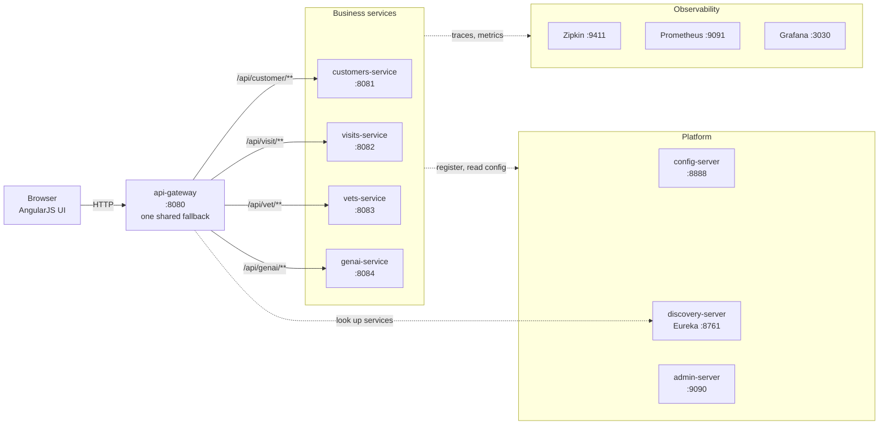
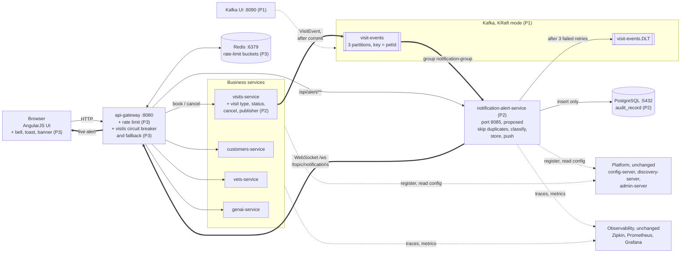
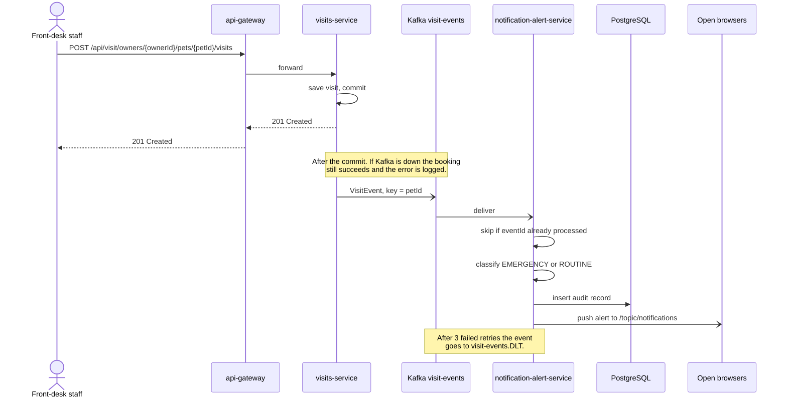

# Architecture

Two views: the system as it is at the baseline, and the target at the end of Phase 3.
GitHub renders the diagrams below directly.

## Today: baseline `aefaf7f`

Every request is synchronous. The gateway forwards it to one service and waits for the answer.
No other service learns that a visit was booked.

Each business service keeps its own data in an in-memory HSQLDB database (MySQL is optional).

## Target: end of Phase 3

Booking stays synchronous and returns as before. After the commit, visits-service publishes an
event; everything to the right of Kafka happens after the user already has their answer.

Thick arrows are the asynchronous path added by this project. `(P1)`, `(P2)` and `(P3)` mark
the phase that adds each part. The platform services and the observability stack stay as they
are today; they are drawn as one box each to keep the diagram readable. Port 8085 for
notification-alert-service is the plan's proposal and is confirmed in W7.

### How a booking flows

## Related documents

- [Spike: what the baseline lacks](spikes/baseline-limitations.md)
- [VisitEvent contract](../contracts/README.md)
- [Setup guide](../SETUP.md)
