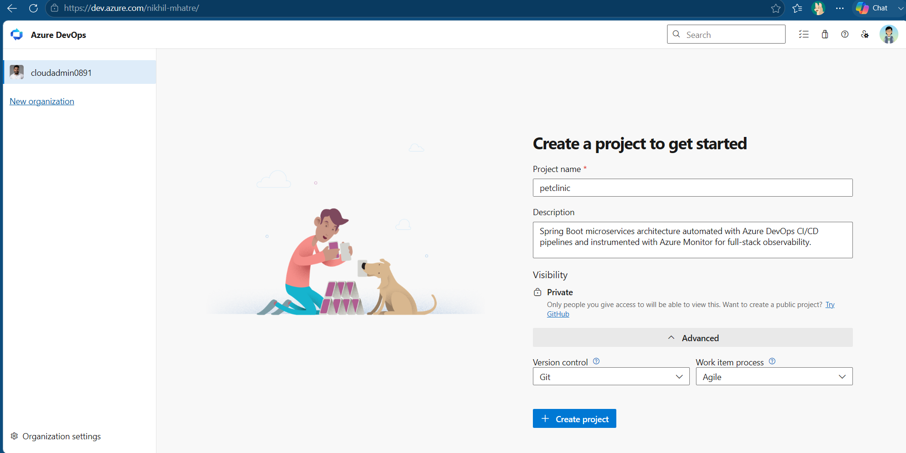

# Azure DevOps Deployment Guide

## 1. Create Project in Azure DevOps

Follow these steps to initialize your project workspace in Azure DevOps:

### Prerequisites & Organization Setup

1. Open your browser and navigate to [Azure DevOps](https://dev.azure.com).
2. Select your existing organization (e.g., `dev.azure.com/nikhil-mhatre` or `dev.azure.com/<your-organization-name>`).
   - _If you do not have an organization yet, select **Create new organization**, enter your desired organization name, choose your preferred cloud region, and proceed._

---

### Project Configuration Steps

1. On the Organization landing page, click the **+ New project** button in the top-right corner.
2. Fill in the following project parameters:

| Configuration Field | Value                                                                                           | Description / Purpose                                                                                              |
| ------------------- | ----------------------------------------------------------------------------------------------- | ------------------------------------------------------------------------------------------------------------------ |
| **Project name**    | `petclinic`                                                                                     | Matches the Spring PetClinic microservices application workspace.                                                  |
| **Description**     | `Containerized Spring Boot microservices deployment pipeline with Azure Monitor observability.` | Explains the project's technical scope to evaluators and team members.                                             |
| **Visibility**      | `Private`                                                                                       | Keeps pipeline configurations private within Azure DevOps while referencing your public/private GitHub repository. |

3. Expand the **Advanced** settings panel at the bottom of the dialog:

| Advanced Setting      | Selected Option | Description / Purpose                                                                         |
| --------------------- | --------------- | --------------------------------------------------------------------------------------------- |
| **Version control**   | `Git`           | Standard distributed version control system.                                                  |
| **Work item process** | `Agile`         | Uses User Stories, Tasks, and Sprints—matching industry-standard agile engineering workflows. |

4. Click **Create**. Azure DevOps will provision your project workspace and navigate to the project dashboard.

---

### Verification Screenshot

_Figure 1.1: Project creation modal in Azure DevOps with name, description, private visibility, Git version control, and Agile process selected._
