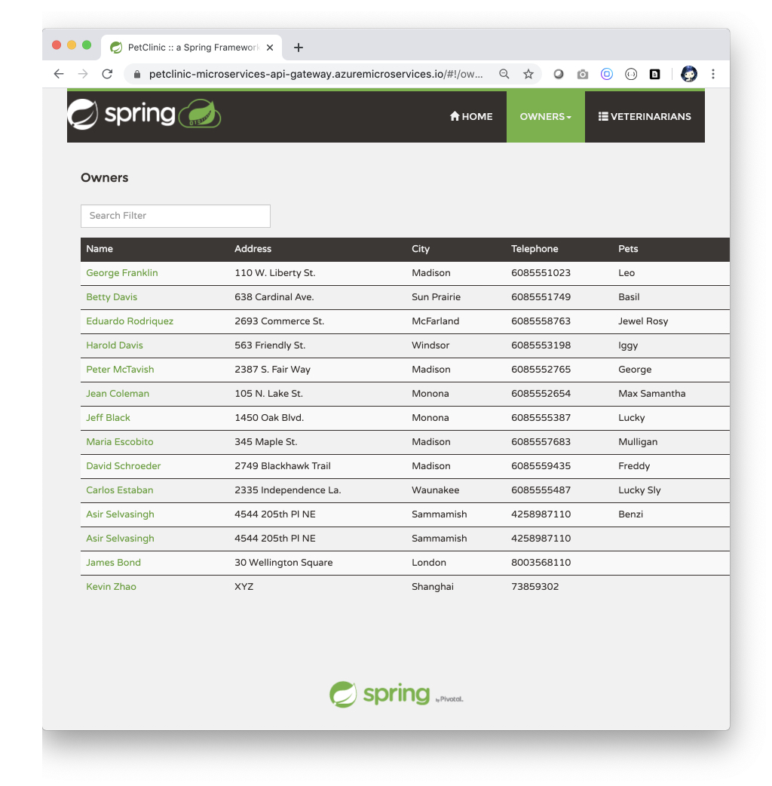

# Deploy Spring Microservices using Azure Spring Cloud and MySQL 

Azure Spring Cloud enables you to easily run a Spring Boot based microservices application on Azure.

This quickstart shows you how to deploy an existing Java Spring Cloud application to Azure. When you're finished, you can continue to manage the application via the Azure CLI or switch to using the Azure portal.

## What will you experience
You will:
- Build existing Spring microservices applications
- Provision an Azure Spring Cloud service instance using Terraform
- Deploy applications to Azure
- Bind applications to Azure Database for MySQL
- Open the application

## What you will need

In order to deploy a Java app to cloud, you need 
an Azure subscription. If you do not already have an Azure 
subscription, you can activate your 
[MSDN subscriber benefits](https://azure.microsoft.com/pricing/member-offers/msdn-benefits-details/) 
or sign up for a 
[free Azure account]((https://azure.microsoft.com/free/)).

In addition, you will need the following:

| [Azure CLI version 2.0.67 or higher](https://docs.microsoft.com/cli/azure/install-azure-cli?view=azure-cli-latest) 
| [Java 8](https://www.azul.com/downloads/azure-only/zulu/?version=java-8-lts&architecture=x86-64-bit&package=jdk) 
| [Maven](https://maven.apache.org/download.cgi) 
| [MySQL CLI](https://dev.mysql.com/downloads/shell/)
| [Git](https://git-scm.com/)
| [Terraform](https://www.terraform.io/docs/providers/azurerm/index.html)

## Install the Azure CLI extension

Install the Azure Spring Cloud extension for the Azure CLI using the following command

```bash
    az extension add --name spring-cloud
```

## Clone and build the repo

### Create a new folder and clone the sample app repository to your Azure Cloud account  

```bash
    mkdir source-code
    git clone https://github.com/azure-samples/spring-petclinic-microservices
```

### Change directory and build the project

```bash
    cd spring-petclinic-microservices
    mvn clean package -DskipTests -Denv=cloud
```
This will take a few minutes.

### Terraform on Azure

Enable Terraform on Azure and [Authenticate to Azure using the Azure CLI](https://www.terraform.io/docs/providers/azurerm/guides/azure_cli.html) 

### Move to Terraform folder and initialize 
```bash
    cd terraform
    terraform init
```
## Provision Azure Spring Cloud service instance and associated resources using Terraform

### Prepare your environment for deployments

Create a bash script with environment variables by making a copy of the supplied template:
```bash
    cp .scripts/setup-env-variables-terraform-template.sh .scripts/setup-env-variables-terraform.sh
```

Open `.scripts/setup-env-variables-terraform.sh` and enter the following information:

```bash

    export SUBSCRIPTION=subscription-id # customize this
    export RESOURCE_GROUP=resource-group-name # customize this
    ...
    export SPRING_CLOUD_SERVICE=azure-spring-cloud-name # customize this
    ...
    export MYSQL_SERVER_NAME=mysql-servername # customize this
    ...
    export MYSQL_SERVER_ADMIN_NAME=admin-name # customize this
    ...
    export MYSQL_SERVER_ADMIN_PASSWORD=SuperS3cr3t # customize this
    ...
    export TF_VAR_dev_machine_ip=123.123.123.123  # customize this
```

Then, set the environment:
```bash
    source .scripts/setup-env-variables-terraform.sh
```

### Login to Azure using Terraform
Login to the Azure CLI and choose your active subscription. Be sure to choose the active subscription that is whitelisted for Azure Spring Cloud. We will use Azure CLI to login to Terraform as mentioned [here](https://www.terraform.io/docs/providers/azurerm/guides/azure_cli.html).

```bash
    az login
    az account list -o table
    az account set --subscription ${SUBSCRIPTION}
```

### Create Azure Spring Cloud service instance
We will use Terraform to create the following resources required for this application
* Azure Spring Cloud Service
* Azure spring Cloud Micro Services
* MySQL Server
* MySQL Firewall rules
* MySQL Database
* MySQL Configurations

```bash
    cd terraform
    terraform init
    terraform plan
    terraform apply
```


The service instance will take around five minutes to deploy.


## Create MySQL table

We already have MySQL database created. We can create the table and root user using command line.

```bash
   
    // SUBSTITUTE values
    mysql -u ${MYSQL_SERVER_ADMIN_LOGIN_NAME} \
     -h ${MYSQL_SERVER_FULL_NAME} -P 3306 -p
    
    Enter password:
    Welcome to the MySQL monitor.  Commands end with ; or \g.
    Your MySQL connection id is 64379
    Server version: 5.6.39.0 MySQL Community Server (GPL)
    
    Copyright (c) 2000, 2018, Oracle and/or its affiliates. All rights reserved.
    
    Oracle is a registered trademark of Oracle Corporation and/or its
    affiliates. Other names may be trademarks of their respective
    owners.
    
    Type 'help;' or '\h' for help. Type '\c' to clear the current input statement.
    
    mysql> CREATE USER 'root' IDENTIFIED BY 'petclinic';
    Query OK, 0 rows affected (0.11 sec)
    
    mysql> GRANT ALL PRIVILEGES ON petclinic.* TO 'root';
    Query OK, 0 rows affected (1.29 sec)
    
    
    mysql> quit
    Bye
    
```

## Deploy applications and set environment variables

Deploy microservice applications to Azure.

```bash
    cd ../
    az spring-cloud app deployment create -n ${API_GATEWAY} --app ${API_GATEWAY} -s ${SPRING_CLOUD_SERVICE} \
         -g ${RESOURCE_GROUP} --jar-path ${API_GATEWAY_JAR}  --skip-clone-settings

    az spring-cloud app set-deployment -d ${API_GATEWAY} -n ${API_GATEWAY} -s ${SPRING_CLOUD_SERVICE} -g ${RESOURCE_GROUP}

    az spring-cloud app update --name ${API_GATEWAY} --is-public true

    az spring-cloud app deployment create -n ${ADMIN_SERVER} --app ${ADMIN_SERVER} -s ${SPRING_CLOUD_SERVICE} -g ${RESOURCE_GROUP} --jar-path ${ADMIN_SERVER_JAR}  --skip-clone-settings

    az spring-cloud app set-deployment -d ${ADMIN_SERVER} -n ${ADMIN_SERVER} -s ${SPRING_CLOUD_SERVICE} -g ${RESOURCE_GROUP}

    az spring-cloud app deployment create -n ${CUSTOMERS_SERVICE} --app ${CUSTOMERS_SERVICE} -s ${SPRING_CLOUD_SERVICE} -g ${RESOURCE_GROUP} --jar-path ${CUSTOMERS_SERVICE_JAR}   --skip-clone-settings --env MYSQL_SERVER_FULL_NAME=${MYSQL_SERVER_FULL_NAME} \
                MYSQL_DATABASE_NAME=${MYSQL_DATABASE_NAME} \
                MYSQL_SERVER_ADMIN_LOGIN_NAME=${MYSQL_SERVER_ADMIN_LOGIN_NAME} \
                MYSQL_SERVER_ADMIN_PASSWORD=${MYSQL_SERVER_ADMIN_PASSWORD}

    az spring-cloud app set-deployment -d ${CUSTOMERS_SERVICE} -n ${CUSTOMERS_SERVICE} -s ${SPRING_CLOUD_SERVICE} -g ${RESOURCE_GROUP}

    az spring-cloud app deployment create -n ${VETS_SERVICE} --app ${VETS_SERVICE} -s ${SPRING_CLOUD_SERVICE} -g ${RESOURCE_GROUP} --jar-path ${VETS_SERVICE_JAR}   --skip-clone-settings --env MYSQL_SERVER_FULL_NAME=${MYSQL_SERVER_FULL_NAME} \
                MYSQL_DATABASE_NAME=${MYSQL_DATABASE_NAME} \
                MYSQL_SERVER_ADMIN_LOGIN_NAME=${MYSQL_SERVER_ADMIN_LOGIN_NAME} \
                MYSQL_SERVER_ADMIN_PASSWORD=${MYSQL_SERVER_ADMIN_PASSWORD}

    az spring-cloud app set-deployment -d ${VETS_SERVICE} -n ${VETS_SERVICE} -s ${SPRING_CLOUD_SERVICE} -g ${RESOURCE_GROUP}

    az spring-cloud app deployment create -n ${VISITS_SERVICE} --app ${VISITS_SERVICE} -s ${SPRING_CLOUD_SERVICE} -g ${RESOURCE_GROUP} --jar-path ${VISITS_SERVICE_JAR}   --skip-clone-settings --env MYSQL_SERVER_FULL_NAME=${MYSQL_SERVER_FULL_NAME} \
                MYSQL_DATABASE_NAME=${MYSQL_DATABASE_NAME} \
                MYSQL_SERVER_ADMIN_LOGIN_NAME=${MYSQL_SERVER_ADMIN_LOGIN_NAME} \
                MYSQL_SERVER_ADMIN_PASSWORD=${MYSQL_SERVER_ADMIN_PASSWORD}

    az spring-cloud app set-deployment -d ${VISITS_SERVICE} -n ${VISITS_SERVICE} -s ${SPRING_CLOUD_SERVICE} -g ${RESOURCE_GROUP}

```

```bash
    az spring-cloud app show --name ${APP_NAME} | grep url
```

Navigate to the URL provided by the previous command to open the Pet Clinic microservice application.
    


## Next Steps

In this quickstart, you've deployed an existing Spring microservices app using Azure CLI. To learn more about Azure Spring Cloud, go to:

- [Azure Spring Cloud](https://azure.microsoft.com/en-us/services/spring-cloud/)
- [Azure Spring Cloud docs](https://docs.microsoft.com/en-us/azure/java/)
- [Deploy Spring microservices from scratch](https://github.com/microsoft/azure-spring-cloud-training)
- [Deploy existing Spring microservices](https://github.com/Azure-Samples/azure-spring-cloud)
- [Azure for Java Cloud Developers](https://docs.microsoft.com/en-us/azure/java/)
- [Spring Cloud Azure](https://cloud.spring.io/spring-cloud-azure/)
- [Spring Cloud](https://spring.io/projects/spring-cloud)

## Credits

This Spring microservices sample is forked from 
[spring-petclinic/spring-petclinic-microservices](https://github.com/spring-petclinic/spring-petclinic-microservices) - see [Petclinic README](../README-petclinic.md). 

## Contributing

This project welcomes contributions and suggestions.  Most contributions require you to agree to a
Contributor License Agreement (CLA) declaring that you have the right to, and actually do, grant us
the rights to use your contribution. For details, visit https://cla.opensource.microsoft.com.

When you submit a pull request, a CLA bot will automatically determine whether you need to provide
a CLA and decorate the PR appropriately (e.g., status check, comment). Simply follow the instructions
provided by the bot. You will only need to do this once across all repos using our CLA.

This project has adopted the [Microsoft Open Source Code of Conduct](https://opensource.microsoft.com/codeofconduct/).
For more information see the [Code of Conduct FAQ](https://opensource.microsoft.com/codeofconduct/faq/) or
contact [opencode@microsoft.com](mailto:opencode@microsoft.com) with any additional questions or comments.
